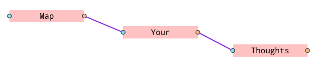

# nodeco

node/mindmap project, further development is an open question..


Use your favorite server to test.
As an example ```python -m http.server``` is a quick choice.

### Usage/features
- Double-click to create new nodes
- Drag to move selected
- Start dragging "endpoints" (the circles) to create noodles
  - Need to start and end to an "endpoint". Blue in, orange out. Only in -> out or
    out -> in is allowed
- Bounding-box selection
- Ctrl + drag to knife noodles
- Delete-key to delete selected nodes